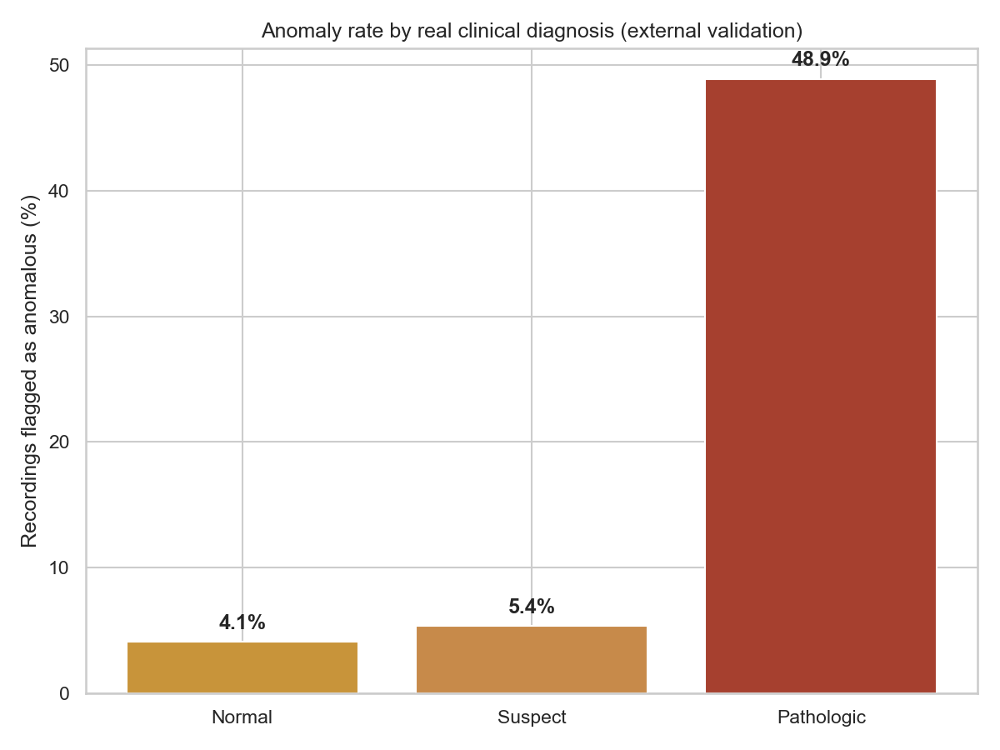
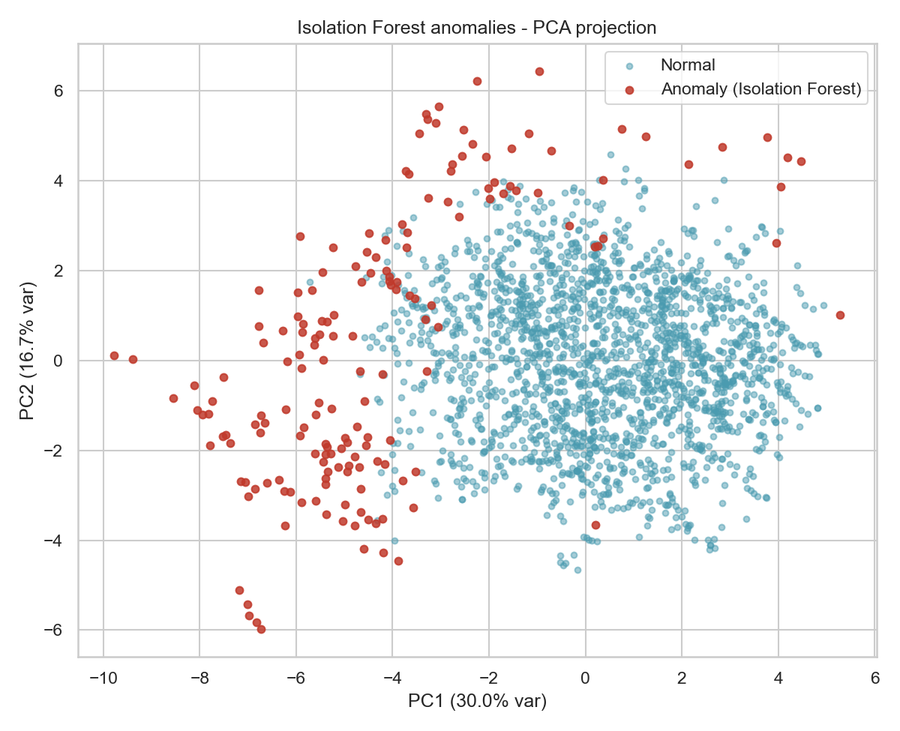
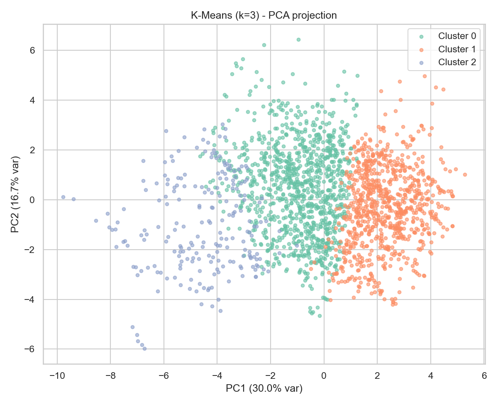

# Fetal Health Risk Detection & Clustering

Unsupervised anomaly detection and clustering on 2,126 real fetal cardiotocography (CTG) recordings — cross-validated against the real diagnosis assigned by expert obstetricians, which neither model ever saw during fitting.

## Headline result

| Real clinical diagnosis | % flagged anomalous by Isolation Forest | n |
|---|---|---|
| Normal | 4.1% | 1,655 |
| Suspect | 5.4% | 295 |
| **Pathologic** | **48.9%** | 176 |

The model never saw these labels. Statistical "unusual" and clinical "at risk" agree far more than chance: **~12x** more anomalies among real Pathologic cases than real Normal cases.

K-Means (k=3) recovers the same structure without supervision: one cluster is 96% Normal (1,019/1,057), while another inverts the population-level rate — Pathologic (106) outnumbers Normal (98) inside it, even though Pathologic is only 8% of the full dataset.

## Data

2,126 real cardiotocograms, automatically processed and diagnostically classified by three expert obstetricians (consensus label), sourced from the UCI Machine Learning Repository.

> Ayres-de-Campos, D., Bernardes, J., Garrido, A., Marques-de-Sa, J., & Pereira-Leite, L. (2000). SisPorto 2.0: A program for automated analysis of cardiotocograms. *Journal of Maternal-Fetal Medicine, 9*(5), 311–318.
>
> Campos, D., & Bernardes, J. (2000). *Cardiotocography* [Dataset]. UCI Machine Learning Repository. https://doi.org/10.24432/C51S4N

21 measured features per recording (FHR baseline, accelerations, fetal movements, uterine contractions, decelerations, short/long-term variability, 10 FHR-histogram descriptors) plus two expert-assigned targets: `CLASS` (1 of 10 morphologic pattern codes) and `NSP` (fetal state: Normal / Suspect / Pathologic).

## Method

1. **Cleaning** — dropped 3 non-record rows (export artifacts, not real observations) and 1 zero-variance field (`DR`, constant across every record in this export).
2. **EDA** — descriptive statistics on all 20 numeric features, frequency tables for the coded categorical fields, full correlation matrix (`results_correlation_matrix.csv`).
3. **Anomaly detection** — Isolation Forest (`n_estimators=300`, `contamination=0.08`), fit only on the 20 standardized numeric features. `NSP`/`CLASS` were never part of the training matrix.
4. **Clustering** — K-Means, k selected by silhouette score across k=2–7 (`results.json`); k=3 additionally fit because `NSP` already provides 3 real clinical groups to validate against.
5. **External clinical cross-check** — flagged recordings with baseline FHR outside ACOG's normal range (110–160 bpm). Only 7 of 2,126 fall outside it, and none overlap with the multivariate anomalies — an honest finding, not forced to agree: the multivariate model catches risk patterns that a single-variable clinical threshold alone would miss.

> American College of Obstetricians and Gynecologists. (2025). *Intrapartum fetal heart rate monitoring: Interpretation and management* [Clinical practice guideline]. ACOG.

## Files

- `analysis.py` — full, commented, reproducible pipeline (`pip install pandas numpy scikit-learn matplotlib seaborn && python analysis.py`).
- `CTG.csv` — source data (Kaggle mirror of the UCI Cardiotocography dataset).
- `results.json` — every numeric result referenced above and in the write-up.
- `results_numeric_summary.csv`, `results_correlation_matrix.csv` — full EDA tables.
- `ctg_clean_with_results.csv` — cleaned dataset with anomaly flags and cluster assignments attached, one row per recording.
- `figures/` — all charts, including the ones used on [datavisionary-consulting.github.io](https://datavisionary-consulting.github.io/#solutions).

## Why K-Means and Isolation Forest

**Isolation Forest** was chosen over distance-based alternatives (e.g. Local Outlier Factor, One-Class SVM) because it scales linearly, makes no assumption about cluster shape or density, and is specifically built for the kind of multivariate, moderate-dimensional tabular data this dataset is (20 numeric features, no strong linear separability). Its main limitation: `contamination` is a modeling assumption the analyst sets, not learned from data.

**K-Means** was chosen for its interpretability (each cluster has a clear centroid profile) and because it scales cleanly to re-running against new recordings. Its main limitation: it assumes roughly spherical, similarly-sized clusters — the moderate silhouette scores here (0.17–0.21) reflect that real clinical states don't separate as cleanly as synthetic data would.
