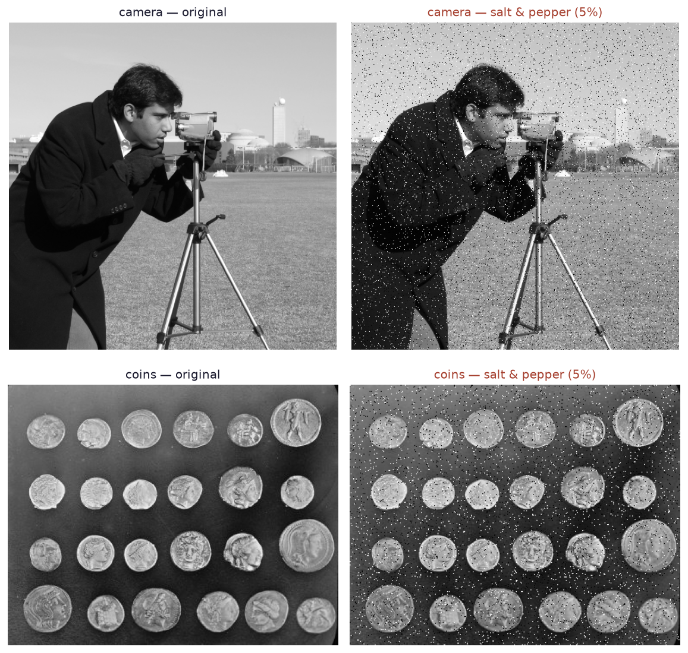
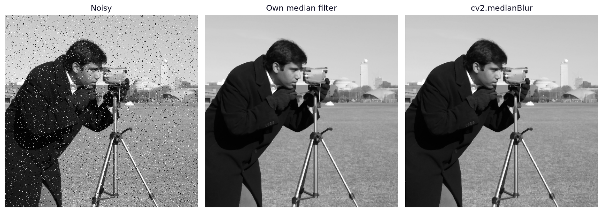
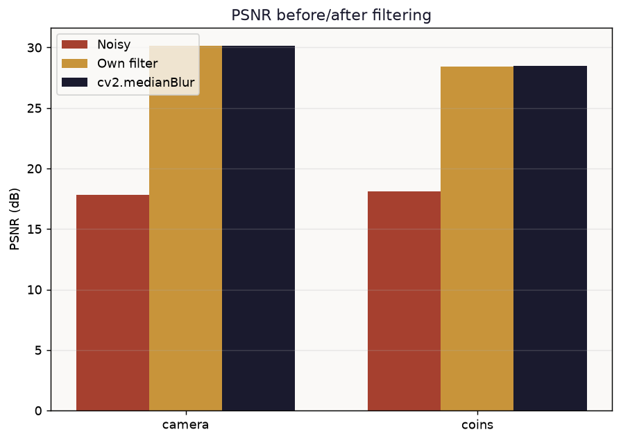
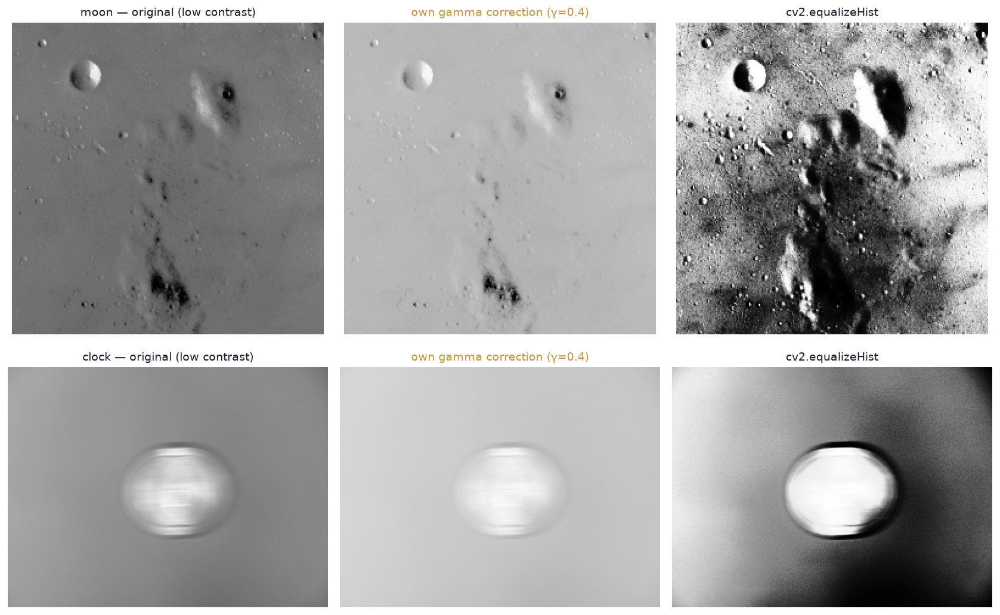

# Impulse Noise Restoration & Contrast Enhancement

Two classical image-processing pipelines — median-filter denoising and gamma/histogram-equalization contrast enhancement — implemented from scratch in NumPy and benchmarked against their OpenCV equivalents, on public-domain sample images.

## Headline result

| Metric | camera | coins |
|---|---|---|
| PSNR, noisy vs. original | 17.81 dB | 18.12 dB |
| PSNR, own median filter vs. original | 30.12 dB | 28.45 dB |
| PSNR, `cv2.medianBlur` vs. original | 30.12 dB | 28.49 dB |
| MSE reduction after filtering | **94.1%** | **90.7%** |
| Own implementation vs. OpenCV runtime | 5.18 s | 2.24 s |
| `cv2.medianBlur` runtime | 0.13 ms | 0.07 ms |

The from-scratch NumPy median filter and OpenCV's C++ implementation converge on statistically identical restorations (PSNR within 0.04 dB) — proof the underlying math is correct — while differing by four orders of magnitude in speed, which is the actual reason production systems never loop over pixels in Python.

## Data

Public-domain / permissively-licensed sample images bundled with scikit-image (`camera`, `coins`, `moon`, `clock`, `page`, `text`) — chosen specifically so this write-up and its figures can be published without any privacy or copyright concern.

> van der Walt, S., Schönberger, J. L., Nunez-Iglesias, J., Boulogne, F., Warner, J. D., Yager, N., Gouillart, E., & Yu, T. (2014). scikit-image: image processing in Python. *PeerJ, 2*, e453. https://doi.org/10.7717/peerj.453

## Method

**Phase 1 — Noise removal.** 5% salt-and-pepper (impulse) noise injected into `camera` and `coins` with a reproducible seed. Removed two ways:
- A from-scratch NumPy median filter: reflect-padding, then for every pixel, sort its 3×3 neighborhood and take the middle value — O(H·W·k²·log k).
- `cv2.medianBlur`, which uses Huang's sliding-histogram algorithm internally — O(H·W), since the histogram is updated incrementally as the window slides instead of being re-sorted from scratch each time.

Both scored against the clean original with hand-implemented MSE and PSNR.

> Huang, T. S., Yang, G. J., & Tang, G. Y. (1979). A fast two-dimensional median filtering algorithm. *IEEE Transactions on Acoustics, Speech, and Signal Processing, 27*(1), 13–18. https://doi.org/10.1109/TASSP.1979.1163188
>
> Gonzalez, R. C., & Woods, R. E. (2018). *Digital Image Processing* (4th ed.). Pearson.

**Phase 2 — Contrast enhancement.** Six candidate images are scanned and ranked by intensity standard deviation (σ) — no manual picking. The two lowest-σ images (`moon`, σ=13.3; `clock`, σ=20.9) are treated as "low contrast" and enhanced two ways:
- A from-scratch NumPy gamma (power-law) correction, `s = c·(r/255)^γ·255` with γ=0.4, applied via a 256-entry lookup table.
- `cv2.equalizeHist`, which redistributes gray levels using the cumulative distribution function to spread the histogram across the full [0, 255] range.

| Metric | moon | clock |
|---|---|---|
| σ, original | 13.33 | 20.91 |
| σ, own gamma (γ=0.4) | 11.63 (−12.7%) | 11.05 (−47.2%) |
| σ, `cv2.equalizeHist` | 74.01 (**+455%**) | 73.14 (**+250%**) |
| mean, original | 112.2 | 146.3 |
| mean, own gamma | 182.6 (+62.8%) | 203.3 (+38.9%) |

**Honest finding, not a forced one:** gamma correction with γ<1 reliably *brightens* the image (mean intensity up 39–63%) but does not reliably *increase contrast* — on both test images σ actually dropped, because the power-law curve compresses the mid-tones it pushes upward. Histogram equalization is the method that actually maximizes contrast (σ up 250–455%), because it redistributes the pixel distribution itself rather than just remapping it along a fixed curve. The two techniques solve different problems: gamma is the right tool when the complaint is "the image is dark," equalization is the right tool when the complaint is "the image is low-contrast."

## Files

- `analysis.py` — full, commented, reproducible pipeline (`pip install numpy opencv-python-headless matplotlib scikit-image && python analysis.py`).
- `results.json` — every numeric result referenced above.
- `figures/` — all charts, including the ones used on [datavisionary-consulting.github.io](https://datavisionary-consulting.github.io/#solutions).

## Why median filtering and histogram equalization

**Median filtering** was chosen over a mean/Gaussian filter because it is non-linear: it replaces a pixel with an actual neighborhood value rather than a weighted average, so extreme outliers (salt/pepper pixels, which sit at the sorted extremes of any neighborhood) are excluded rather than blended in — the filter removes impulse noise without the edge-blurring a linear filter would cause. Its main limitation is exactly the runtime shown above: a naive per-pixel implementation is orders of magnitude slower than the sliding-histogram approach OpenCV uses internally.

**Histogram equalization** was chosen over further gamma tuning as the maximum-contrast method because it is parameter-free and adapts to each image's actual distribution, rather than requiring a hand-picked exponent. Its main limitation is that it can over-amplify contrast in images with a strong existing peak (visible in the `moon` result, where craters become more sharply bimodal than a human editor would typically choose).
