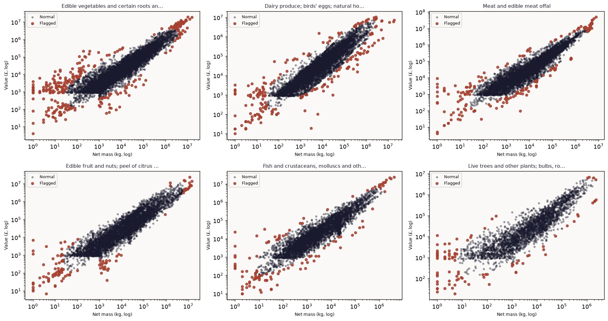
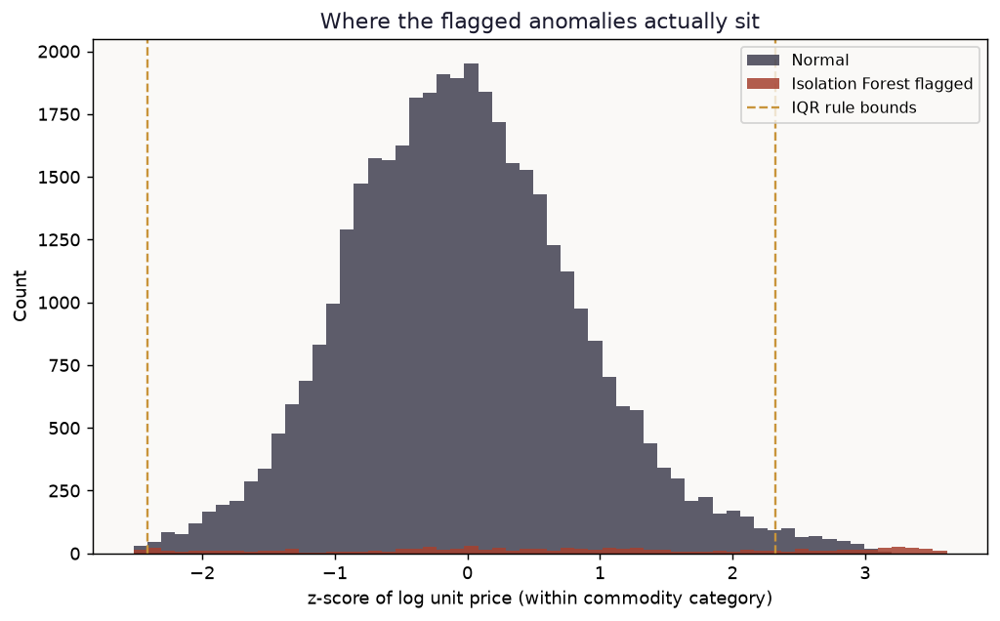
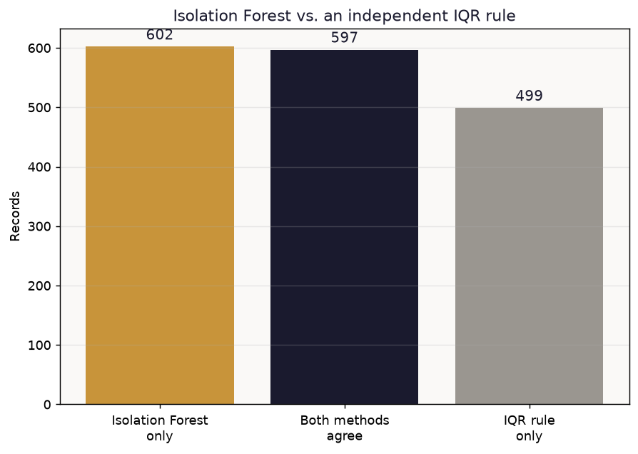
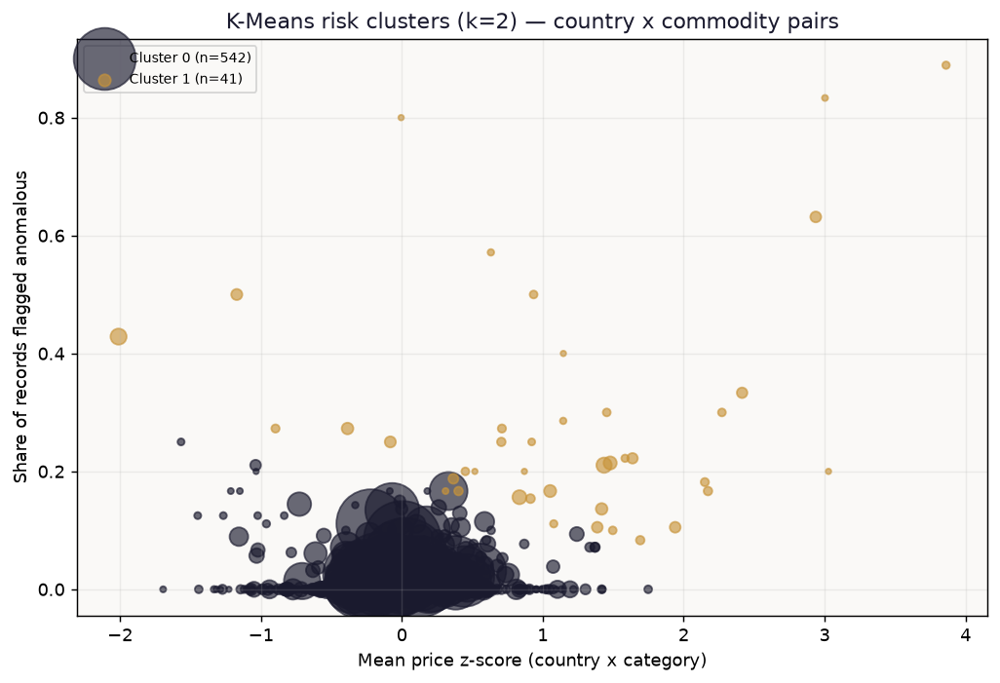

# Import Price Anomaly Detection & Country Risk Clustering

Real UK customs import records, used to flag statistically unusual declared unit prices — the same signal customs risk analysts check for under- or over-invoicing — and to cluster country × commodity pairs into risk tiers. Cross-checked against an independent statistical rule rather than assumed correct.

## Headline result

39,955 real import shipments (EU + non-EU, 4 months of 2024), 19 commodity categories, 164 countries.

| Metric | Value |
|---|---|
| Flagged by Isolation Forest | 1,199 / 39,955 (3.0%) |
| Also flagged by an independent IQR rule | 597 (49.8% of flags) |
| Isolation Forest only (joint price+value signal) | 602 |
| IQR only (price-only, missed by Isolation Forest) | 499 |
| K-Means risk clusters (k=2, silhouette-selected) | Normal: 542 pairs, 1.7% anomaly rate · High-risk: 41 pairs, **29.3%** anomaly rate |

**Honest finding:** only about half of Isolation Forest's flags are also price-only outliers. That's not a validation failure — it shows the two methods are catching genuinely different things. Isolation Forest jointly weighs price *and* value, so it catches shipments where the combination looks off even when price alone isn't extreme; a naive price-only rule catches the reverse case. Neither one is simply "more correct."

## Data

Real, live UK Overseas Trade Statistics — declared value (£) and net mass (kg) per import shipment — queried directly from HM Revenue & Customs' public API.

> HM Revenue & Customs. (2024). *UK Overseas Trade Statistics* [Data set]. uktradeinfo.com. https://api.uktradeinfo.com

The API (`api.uktradeinfo.com`) is open access — no account or key required. `download.py` documents the exact queries used: one month per quarter of 2024 (January, April, July, October), EU and non-EU import flows, filtered to records where both value and net mass are populated. Nothing here is cherry-picked by commodity or country; the sample is whatever the API returned for that filter.

## Method

1. **Unit price**, per shipment: `value_gbp / net_mass_kg`. Standardized as a z-score of `log(unit price)` *within each commodity category* — comparing a kilo of live animals against a kilo of electrical machinery on the same raw scale would just rediscover category price differences, not real anomalies.
2. **Isolation Forest** (Liu, Ting & Zhou, 2008), fit on standardized price and value jointly, unsupervised, flags the 3% most unusual shipments. No labeled "confirmed fraud" data was used or exists publicly at the per-shipment level — this is an honest limitation shared by the entire published literature on this problem, not specific to this project.
3. **Cross-check**: an independent, transparent IQR rule on price alone (bounds at Q1 − 1.5·IQR and Q3 + 1.5·IQR), to see whether Isolation Forest's flags hold up against a method with zero shared logic.
4. **K-Means** groups country × commodity pairs (≥5 records each) by mean price deviation, anomaly rate, and log shipment count into risk tiers; k chosen by silhouette score across k=2–6.

## References

> Alwanin, R., Ismail, M., & Bchir, O. (2025). Customs fraud detection using a gradient boosting approach for joint classification and risk estimation. *Scientific Reports, 15*. https://doi.org/10.1038/s41598-025-33382-z
>
> Kim, S., Tsai, Y. C., Singh, K., Choi, Y., Ibok, E., Li, C. T., & Cha, M. (2020). DATE: Dual attentive tree-aware embedding for customs fraud detection. In *Proceedings of the 26th ACM SIGKDD International Conference on Knowledge Discovery & Data Mining* (pp. 2880–2890). https://doi.org/10.1145/3394486.3403339
>
> Liu, F. T., Ting, K. M., & Zhou, Z.-H. (2008). Isolation forest. In *2008 Eighth IEEE International Conference on Data Mining* (pp. 413–422). IEEE. https://doi.org/10.1109/ICDM.2008.17
>
> Pedregosa, F., Varoquaux, G., Gramfort, A., Michel, V., Thirion, B., Grisel, O., ... Duchesnay, E. (2011). Scikit-learn: Machine learning in Python. *Journal of Machine Learning Research, 12*, 2825–2830.

Both customs-specific papers above (2020, 2025) use supervised or semi-supervised models trained on confirmed fraud labels held by national customs agencies — data that, for good reason, is never made public. This project's unsupervised approach is the honest alternative available to anyone without that access: no ground truth to train against, only internal consistency checks (the IQR cross-validation) and the ability to prioritize which shipments a human reviewer should actually look at.

## Files

- `analysis.py` — full, commented, reproducible pipeline (`pip install pandas numpy scikit-learn matplotlib && python analysis.py`).
- `download.py` — how `trade_data_raw.csv` was pulled from the live HMRC API (re-run it for a fresh snapshot).
- `trade_data_raw.csv` — the real data snapshot used for every number above (40,000 raw records; 39,955 after filtering).
- `results.json`, `country_category_clusters.csv` — every numeric result referenced above.
- `figures/` — all charts, including the ones used on [datavisionary-consulting.github.io](https://datavisionary-consulting.github.io/#solutions).
