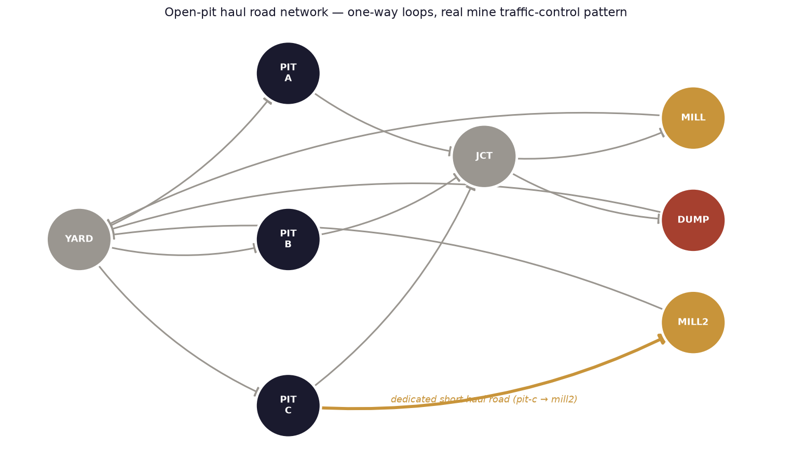
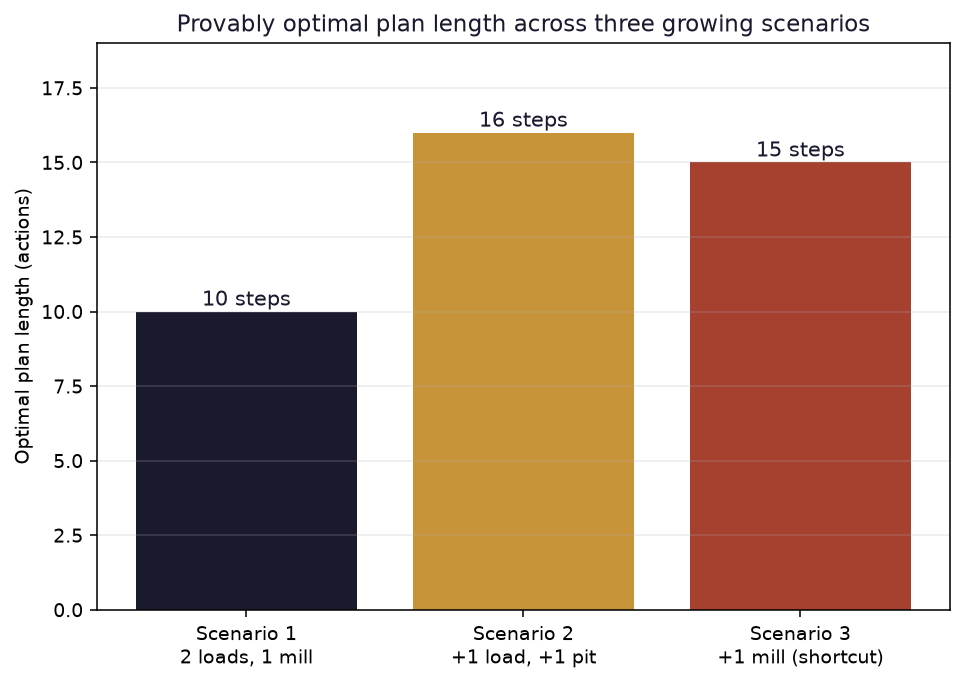

# Automated Haul Truck Dispatch Planning for Open-Pit Mining

A PDDL domain and an optimal classical planner that route open-pit mine haul trucks from extraction benches to the mill or the waste dump over a one-way haul-road network — provably optimal every time, the same domain handling three growing scenarios without a single line changed.

## Headline result

| Scenario | Change | Optimal plan length |
|---|---|---|
| 1 — base | 2 pits, 1 mill, 1 dump, 2 trucks | 10 steps |
| 2 — scaling | +1 pit, +1 ore load | 16 steps |
| 3 — a second mill | +1 mill, with a dedicated shortcut from one pit | **15 steps** |

Scenario 3 has *more* infrastructure than Scenario 2 (an extra mill) and still produces a **shorter** optimal plan — not a coincidence. The planner discovered a dedicated short haul road from Pit C straight to the second mill and used it, instead of routing that ore through the shared junction to the main mill. Nobody told it to prefer the shortcut; it found the actually-cheaper route on its own.




## Why this problem, and why Peru

Open-pit mining is one of Peru's largest industries, and haul truck dispatch — deciding, continuously, which truck goes to which extraction bench and which truck delivers to which mill or dump — is a real, decades-old operations problem in the mining industry worldwide, not a toy example invented for this write-up.

> White, J. W., & Olson, J. P. (1986). Computer-based dispatching in mines with concurrent operating objectives. *Mining Engineering, 38*(11), 1045–1054.

That 1986 paper's dispatching algorithm became the commercial DISPATCH® system, still the most widely used truck-fleet dispatch software in mining today. More recent work keeps returning to the same problem with modern tools:

> Subtil, R. F., Silva, D. M., & Alves, J. C. (2011). A practical approach to truck dispatch for open pit mines. In *35th APCOM Symposium* (pp. 24–30). Wollongong, NSW.

This project takes the same real problem and solves a small instance of it with classical AI planning instead of the queueing/simulation approaches that dominate the mining-engineering literature — provable optimality, not a heuristic dispatch rule, at the cost of only working at the scale classical planning scales to.

## Method

The domain is deliberately close to a real one-way mine layout: trucks start at a yard, drive to a pit, pick up a load (ore or waste), and deliver it — ore only accepted at a location marked `mill`, waste only at a location marked `dump`. Roads are one-way, mirroring the real traffic-control practice of keeping loaded and empty trucks on separate haul roads.

```pddl
(:action deliver-ore
  :parameters (?t - truck ?l - load ?loc - location)
  :precondition (and (at ?t ?loc) (carrying ?t ?l) (ore ?l) (mill ?loc))
  :effect (and (delivered ?l) (free ?t) (not (carrying ?t ?l)))
)
```

Solved with `pyperplan` — a lightweight, pure-Python STRIPS planner (Albert-Ludwigs-Universität Freiburg) — using A* search with the LM-Cut admissible heuristic, which guarantees the returned plan is provably shortest, not merely a fast heuristic answer.

> Fikes, R. E., & Nilsson, N. J. (1971). STRIPS: A new approach to the application of theorem proving to problem solving. *Artificial Intelligence, 2*(3–4), 189–208. https://doi.org/10.1016/0004-3702(71)90010-5
>
> Hart, P. E., Nilsson, N. J., & Raphael, B. (1968). A formal basis for the heuristic determination of minimum cost paths. *IEEE Transactions on Systems Science and Cybernetics, 4*(2), 100–107. https://doi.org/10.1109/TSSC.1968.300136
>
> Helmert, M., & Domshlak, C. (2009). Landmarks, critical paths and abstractions: What's the difference anyway? *Proceedings of the International Conference on Automated Planning and Scheduling, 19*(1), 162–169. https://doi.org/10.1609/icaps.v19i1.13370
>
> Pyperplan [Computer software]. Albert-Ludwigs-Universität Freiburg, AI research group. https://github.com/aibasel/pyperplan

## Why pyperplan, not Fast Downward

The related [rover mission planning](../rover-mission-planning) project in this portfolio runs the same class of problem through Fast Downward inside a Singularity container. This project deliberately used pyperplan instead — a pure-Python planner with zero container or Linux dependency — because A* with an admissible heuristic (LM-Cut, used here; Fast Downward defaults to the same family) gives the same provable-optimality guarantee either way. Different tool, identical guarantee: the point was never the specific planner, it was the search algorithm underneath it.

## Files

- `domain.pddl` — the haul-truck-dispatch domain: move / pick-up / deliver-ore / deliver-waste.
- `problem1.pddl`, `problem2.pddl`, `problem3.pddl` — the three scenarios above.
- `evidence/` — the actual solver output (action-by-action plans) for all three scenarios.
- `figures/` — network diagram and scaling chart, including the ones used on [datavisionary-consulting.github.io](https://datavisionary-consulting.github.io/#solutions).

Reproduce: `pip install pyperplan` then, for each scenario:

```
python -m pyperplan -s astar -H lmcut domain.pddl problem1.pddl
```
