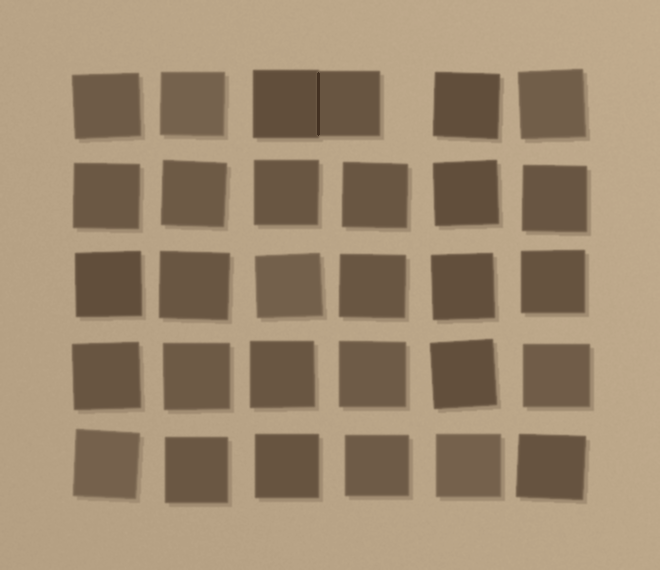
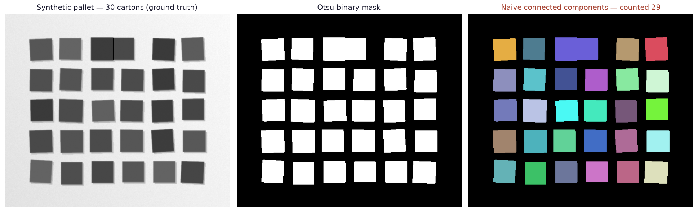
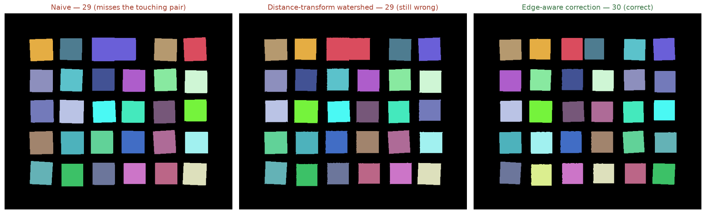
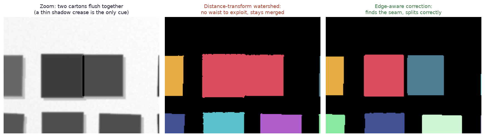
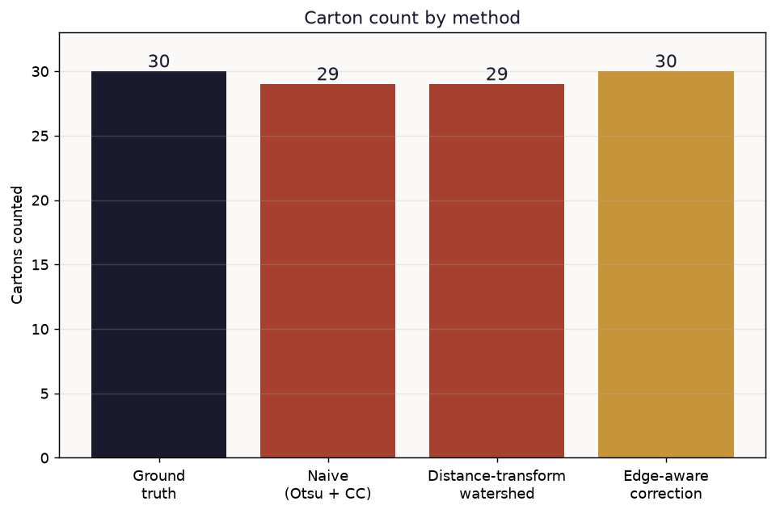

# Automated Pallet & Carton Counting from Images

A synthetic top-down pallet image with a known, exact carton count, and three classical computer-vision counting methods compared honestly against each other — including one that's supposed to fix the problem and doesn't.

## Headline result

| Method | Cartons counted | Error |
|---|---|---|
| Ground truth | 30 | — |
| Naive (Otsu threshold + connected components) | 29 | 1 carton (3.3%) |
| Distance-transform watershed *(the textbook fix)* | 29 | 1 carton (3.3%) — **still wrong** |
| Edge-aware correction | 30 | **0%** |

The naive method undercounts because two cartons are pushed flush against each other and merge into a single blob. Distance-transform watershed — the standard published fix for touching objects (fruit counting, cell counting) — does **not** recover the correct count here, and the reason is structural, not a tuning mistake: it works by finding a concave "waist" where two round objects touch, and two rectangular cartons pushed flush together have no waist at all — their combined silhouette is geometrically indistinguishable from one bigger rectangle. What actually works is exploiting the thin shadow crease at the seam between the two cartons — a real physical cue a photo would show, invisible to a pure binary silhouette.

## Why synthetic, not a real warehouse photo

The image is generated, not photographed — six columns × five rows of cartons with randomized size, rotation, and position jitter, a soft drop shadow per carton, floor lighting gradient, and one deliberately-forced touching pair, rendered with a kraft-cardboard duotone (`pallet_photo.png`) so it reads as cartons on a pallet rather than an abstract grid. This makes the ground truth exact (we know precisely how many cartons were drawn), which is what makes an honest accuracy comparison possible, and it sidesteps any question about rights to a real facility's photo. A real dataset search (Roboflow Universe, Kaggle) turned up several openly-licensed pallet datasets, but none confirmed as a genuine top-down (cenital) angle rather than the side-on forklift-camera view most warehouse datasets use — the counting pipeline itself only assumes classical CV, not the source of the image, so it's a drop-in swap once a verified real photo is available.

## Method

1. **Naive counting** — Otsu thresholding (Otsu, 1979) separates cartons from the floor, then `cv2.connectedComponentsWithStats` counts each connected blob, filtered by a minimum area to reject noise.
2. **Distance-transform watershed** (Vincent & Soille, 1991) — the standard published approach for separating touching objects, used successfully for fruit and produce counting (Zeng et al., 2009; Dorj et al., 2017, validated at R²=0.93 against human counts on citrus trees). Applied here as a direct test, not assumed to work.
3. **Edge-aware correction** — Canny edge detection (Canny, 1986) finds the seam line between adjacent cartons directly in the grayscale image, which is then used to cut the binary mask before re-running connected components.

## References

> Canny, J. (1986). A computational approach to edge detection. *IEEE Transactions on Pattern Analysis and Machine Intelligence, PAMI-8*(6), 679–698. https://doi.org/10.1109/TPAMI.1986.4767851
>
> Dorj, U.-O., Lee, M., & Yun, S.-S. (2017). An yield estimation in citrus orchards via fruit detection and counting using image processing. *Computers and Electronics in Agriculture, 140*, 103–112. https://doi.org/10.1016/j.compag.2017.05.019
>
> Eddahmani, I., Napoléon, T., Pham, C.-H., Badoc, I., & El-Bouz, M. (2025). Towards automation of warehouse management: Counting boxes on pallets via 3D reconstruction from a single image. *Applied Intelligence, 55*(10), 766. https://doi.org/10.1007/s10489-025-06621-z
>
> Otsu, N. (1979). A threshold selection method from gray-level histograms. *IEEE Transactions on Systems, Man, and Cybernetics, 9*(1), 62–66. https://doi.org/10.1109/TSMC.1979.4310076
>
> Vincent, L., & Soille, P. (1991). Watersheds in digital spaces: An efficient algorithm based on immersion simulations. *IEEE Transactions on Pattern Analysis and Machine Intelligence, 13*(6), 583–598. https://doi.org/10.1109/34.87344
>
> Zeng, Q., Miao, Y., Liu, C., & Wang, S. (2009). Algorithm based on marker-controlled watershed transform for overlapping plant fruit segmentation. *Optical Engineering, 48*(2), 027201. https://doi.org/10.1117/1.3076212

The Eddahmani et al. (2025) paper is the current state of the art on this exact problem, and it moves to full 3D reconstruction from a single image specifically because flat 2D silhouettes lose cues that matter for occluded/touching objects — the same structural limitation this project's watershed result demonstrates directly, at a small scale and a fraction of the complexity.

## Why this is worth piloting on a real pallet photo

Every number above comes from a controlled synthetic image with one engineered failure case, which is what makes the comparison honest — but it also means the next real step is obvious: run this same three-method pipeline (Otsu + CC → watershed → edge-aware correction) against an actual photo of a loaded pallet from a real warehouse floor, where lighting, box variety, and stacking are not designed by hand. The pipeline needs no training data and no GPU, which makes it cheap to test end-to-end on a handful of real photos before deciding whether it's worth building further (e.g. into the 3D-reconstruction approach above) for a specific site.

## Files

- `analysis.py` — full, commented, reproducible pipeline (`pip install numpy opencv-python-headless matplotlib && python analysis.py`).
- `results.json` — every numeric result referenced above.
- `figures/` — all charts, including the ones used on [datavisionary-consulting.github.io](https://datavisionary-consulting.github.io/#solutions).
