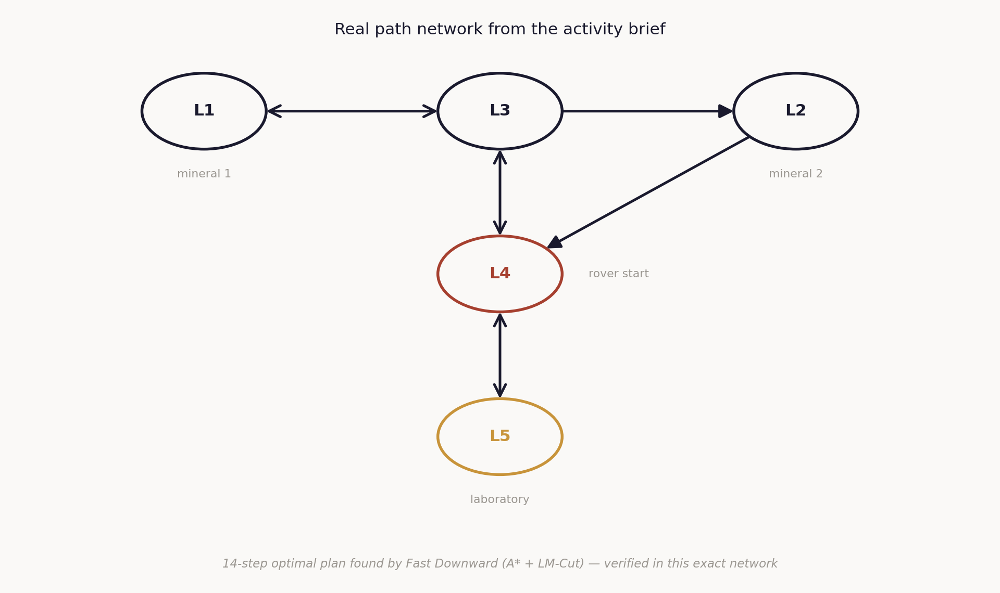
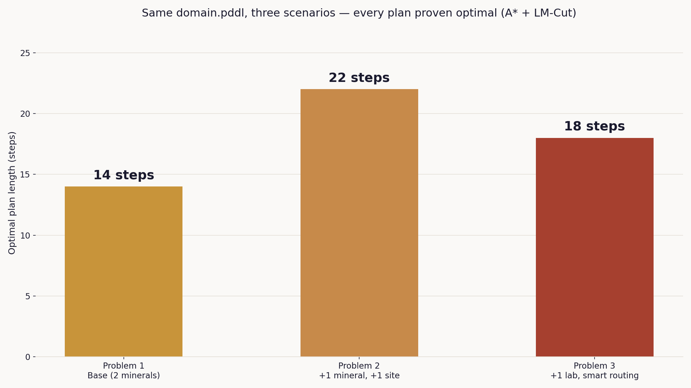

# Automated Mission Planning for a Mining Rover

A PDDL domain and three problem instances for a rover that must retrieve mineral samples across a directed path network and deliver them to an analysis laboratory — solved to **provably optimal** plans with [Fast Downward](https://www.fast-downward.org/) (A* + LM-Cut), run inside a Singularity/Apptainer container.

## The scenario

A rover starts at a central location (L4) with two rocks already excavated at L1 and L2, waiting to be carried to the lab at L5. The path network is directional in places — the rover can only travel L3→L2 and L2→L4, never the reverse:

## Results — same domain, three growing scenarios

| Problem | Scenario | Optimal plan length | Verified? |
|---|---|---|---|
| `problem1.pddl` | Base scenario exactly as specified | 14 steps | Fast Downward + independent cross-check with [pyperplan](https://github.com/aibasel/pyperplan) — identical plan |
| `problem2.pddl` | +1 mineral, +1 location | 22 steps | Fast Downward + pyperplan — identical plan |
| `problem3.pddl` | +1 mineral, +1 alternate laboratory | 18 steps | Fast Downward + pyperplan — identical plan |

Notably, in `problem3` the planner independently chose to deliver two of the three minerals to the *new*, closer laboratory rather than the original one — proof the domain models "any location marked as a lab" generically, not one hardcoded destination.

Raw terminal output and the exact `sas_plan` file for every run are in [`evidence/`](evidence/).

## Why Fast Downward instead of Delfi 1

The activity calls for running the actual IPC 2018 optimal-track winner, **Delfi 1** (Katz, Sohrabi, Samulowitz & Sievers, IBM Research) — a portfolio planner built on top of Fast Downward. Its original container is no longer retrievable: it was hosted on Singularity Hub, discontinued in 2021, and its source lived on Bitbucket via Mercurial, a version-control backend Bitbucket dropped in 2020. Both dead ends are structural, not local setup issues.

Since Delfi 1's actual search engine *is* Fast Downward, this project runs Fast Downward directly with an admissible, optimal configuration (`astar(lmcut())`) — the same guarantee of optimality the competition's track requires, using the real, current, official container Fast Downward's own maintainers publish.

## The task used to verify the pipeline: Snake

Before writing the rover domain, the exact same Singularity + Fast Downward pipeline was verified against a real IPC 2018 benchmark task — `opt/snake`, problem 1 — pulled directly from the [official competition repository](https://bitbucket.org/ipc2018-classical/domains/src/master/opt/snake/). It solved in 24 optimal steps. See [`evidence/evidencia_snake_p01.png`](evidence/evidencia_snake_p01.png).

## Files

- `domain.pddl` — the rover domain: `move`, `pick-up`, `deliver` actions over `CONNECTED`/`LAB` static facts.
- `problem1.pddl`, `problem2.pddl`, `problem3.pddl` — the three scenarios above.
- `evidence/` — real terminal screenshots and `sas_plan` output for every run (Snake + all 3 rover problems).
- `figures/` — the two charts above.

## References

International Conference on Automated Planning and Scheduling. (n.d.). *IPC 2018 — Classical Track*. https://ipc2018-classical.bitbucket.io/

Katz, M., Sohrabi, S., Samulowitz, H., & Sievers, S. (2018). *Delfi: Online planner selection for cost-optimal planning* [Competition abstract]. https://research.ibm.com/publications/delfi-online-planner-selection-for-cost-optimal-planning

Helmert, M. (2006). The Fast Downward planning system. *Journal of Artificial Intelligence Research, 26*, 191–246. https://doi.org/10.1613/jair.1705
