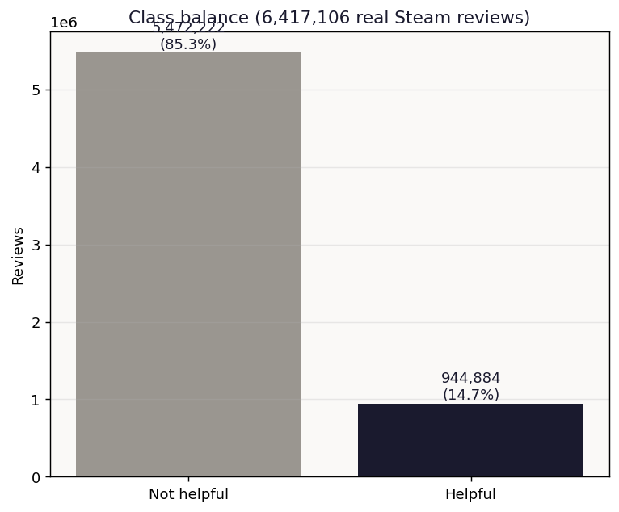
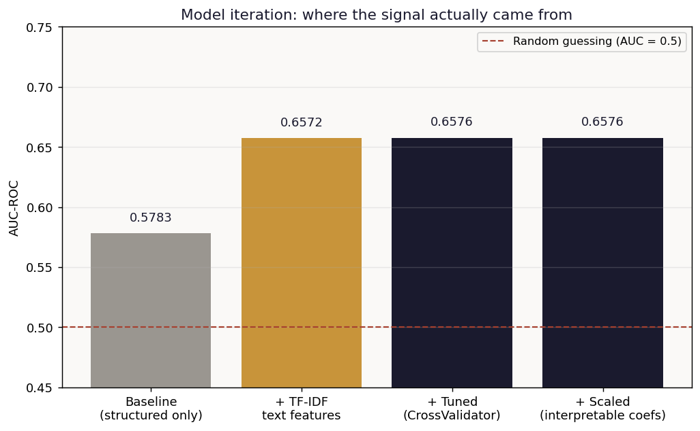
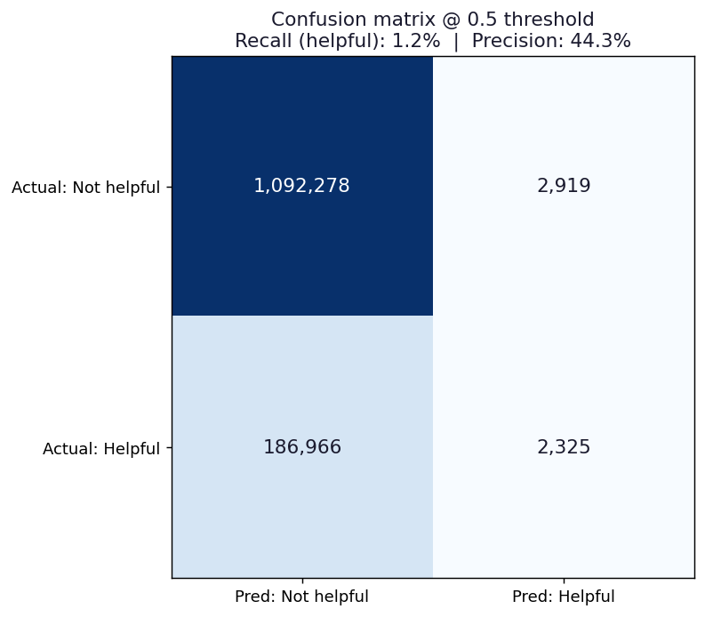
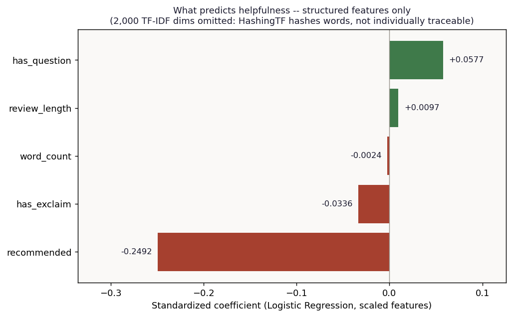

# Steam Review Helpfulness Classification

Predicting whether a Steam review will be marked "helpful" — the same review-ranking problem platforms like Steam and Amazon solve to decide which reviews surface first. Built end-to-end on real data at lakehouse scale (PySpark on Databricks), including a mid-project pivot when the data itself contradicted the original plan.

## Headline result

6,417,106 real English-language Steam reviews (Sobkowicz, 2017), 14.7% marked helpful.

| Stage | AUC-ROC |
|---|---|
| Baseline (review length, word count, punctuation, recommended flag) | 0.578 |
| + TF-IDF text features (2,000 dims) | 0.657 |
| + Hyperparameter tuning (3-fold CrossValidator) | 0.658 |
| + Properly scaled (interpretable coefficients) | 0.658 |

**Honest finding #1 — the pivot:** this project was originally scoped as a *regression* on "helpful vote count." EDA on the real data showed `helpful_votes` is actually a binary flag (max value: 1), not a count — so the project pivoted to classification rather than force a regression that the data doesn't support.

**Honest finding #2 — tuning plateaued:** hyperparameter tuning moved AUC by +0.0004. Not a failed experiment — it shows the model wasn't overfitting, and that the real ceiling is the feature set (mainly the fact that `HashingTF` trades vocabulary-level interpretability for speed), not the regularization strength.

**Honest finding #3 — AUC isn't the whole story:** at the default 0.5 classification threshold, recall on the "helpful" class is only **1.2%**, even though AUC (which ranks across every threshold) is a respectable 0.66. Class imbalance (85%/15%) pulls point predictions toward the majority class. A real deployment would rank reviews by predicted probability, not apply a hard cutoff.

## Data

> Sobkowicz, A. (2017). *Steam Review Dataset (2017)* [Data set]. Zenodo. https://doi.org/10.5281/zenodo.1000885

6.4 million English-language Steam reviews (game ID, review text, recommended flag, helpful flag), CC BY-NC 4.0. Pulled directly into a Databricks lakehouse — `download.py` documents the exact notebook cells (the ~500MB source file and the resulting Delta table never leave Databricks; only the aggregated `results.json` this repo's figures are built from does).

## Method

1. **EDA** on the full 6.4M rows in PySpark confirmed the schema (`helpful_votes` is binary) and the class balance, which is what triggered the regression→classification pivot above.
2. **Baseline**: Logistic Regression on structured features only.
3. **TF-IDF**: `Tokenizer` → `HashingTF` (2,000 features) → `IDF`, combined with the structured features via `VectorAssembler`.
4. **Tuning**: `CrossValidator` (3-fold) over a small `regParam` × `elasticNetParam` grid — kept deliberately small given the data volume (5.1M training rows); an exhaustive grid search wasn't worth the compute for this problem.
5. **Interpretability pass**: refit with `StandardScaler(withMean=False)` — mean-centering a sparse, 2,000-dimension TF-IDF vector would densify it and blow up cost, so only variance-scaling was applied, keeping coefficients comparable without destroying sparsity.
6. **Evaluation**: `BinaryClassificationEvaluator` (AUC-ROC, appropriate for a 85/15 imbalanced target) plus a confusion matrix at the default threshold to surface the recall problem AUC alone hides.

The strongest single structured effect is `recommended` (standardized coefficient −0.25): reviews that *don't* recommend the game are more often marked helpful than purely positive ones — consistent with published findings that review extremity and depth, not just sentiment, drive perceived helpfulness (Mudambi & Schuff, 2010). `review_length` and `word_count` show opposite-sign coefficients, which is a collinearity artifact between two features measuring nearly the same thing, not two genuinely opposing effects.

## References

> Mudambi, S. M., & Schuff, D. (2010). What makes a helpful review? A study of customer reviews on Amazon.com. *MIS Quarterly, 34*(1), 185–200. https://doi.org/10.2307/20721420
>
> Sobkowicz, A. (2017). *Steam Review Dataset (2017)* [Data set]. Zenodo. https://doi.org/10.5281/zenodo.1000885
>
> Zaharia, M., Xin, R. S., Wendell, P., Das, T., Armbrust, M., Dave, A., ... Stoica, I. (2016). Apache Spark: A unified engine for big data processing. *Communications of the ACM, 59*(11), 56–65. https://doi.org/10.1145/2934664

## Files

- `Notebook/01_download_and_load.ipynb` — the actual Databricks notebook that pulls the 6.4M-row dataset from Zenodo and persists it as the `workspace.steam_reviews.reviews_raw` Delta table.
- `Notebook/02_eda_and_features.ipynb` — the actual Databricks notebook covering EDA, the regression→classification pivot, the baseline model, TF-IDF features, `CrossValidator` tuning, the interpretability pass, and the `results.json` export. This is the full modeling pipeline behind every number above.
- `download.py` — a plain-Python mirror of the download notebook's cells, kept for readability outside Databricks. Not runnable locally by design — this is a lakehouse-scale pipeline, not a laptop script.
- `results.json` — every numeric result referenced above, exported from the actual PySpark pipeline.
- `analysis.py` — re-renders `results.json` into the figures below (`pip install matplotlib numpy && python analysis.py`). Does not recompute the model — the 500MB raw dataset and 6.4M-row table intentionally never leave Databricks (see `.gitignore`).
- `figures/` — all charts, including the ones used on [datavisionary-consulting.github.io](https://datavisionary-consulting.github.io/#solutions).
